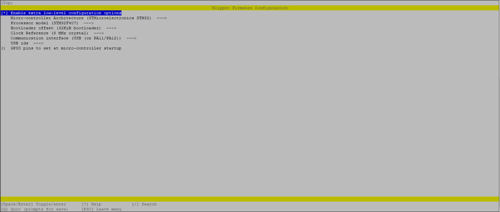

# Climber-8-Upgrades
Some upgrades for the IDEX Climber-8A 3d printer. Includes improved printheads, direct drive extruder, print bed stabilization for high speed printing, configuration for Klipper with filament sensor support, fully functional COPY and MIRROR modes. 

# Why?
Do you want to have two printers in one? Print with two completely different filaments? You don't like bedsilngers and prefer a faster and more compact printer? And not overpaying for a SnapMaker J1S or Ratrig V-Core? Then this upgrade kit is for you! Climber-8A is a very interesting 3D printer from aliexpress, the cheapest IDEX I could find that isn't a bedsilnger. Mechanically and electronically it is quite good, especially for its price, but has a number of flaws very undesirable in 2024, such as for example the bowden feed mechanism, low print speed, no input shaping and so on. This project is designed to fix them! 

# Printing 3d parts

You can find example print projects in *./toolhead* folder. They are configured for Creality K1. You may print everything as you want, but here're recommended settings:
| Parameter  | Value |
| ------------- | ------------- |
| Material  | ABS, ASA, PC, PA, or any other high temp non-flexible material  |
| Infill  | 80-100%  |
| Wall count | 3+ |
|Top/bottom layers| 3 for ducts, 4+ for toolhead|
| Layer height | <=0.12 for ducts, 0.2-0.28 for toolhead |
| Line width | 0.4-0.5 |
| Extra perimeters on overhangs | disabled for ducts |
| Thick bridges | enabled |

# Assembly instructions
[Illustrated step-by-step assembly instructions](assembly.md)

# Klipper config
Use following settings in order to compile MCU firmware. Flash as usual: rename file to firmware.bin, put it onto SD card, insert into 3d printer and boot. If you want to preserve original firmware, copy firmware.cur before flashing.

Then simply import everything from klipper config folder. Change your [mcu] config accordingly. If you aren't using orbiter filament sensor, remove [include BOS.cfg] from printer.cfg. In this case you may want to write your own pause/resume macros. 

# Slicer config
Currentrly I support only prusaslicer. But porting to anything based on it shouldn't be too complicated.
Just import [normal mode](./prusaslicer%20config/config_normal_mode.ini) and [copy mode](./prusaslicer%20config/config_copy_mode.ini) into prusaslicer and set custom bed 3d model to [climber8 platform](./prusaslicer%20config/climber8_platform.STL).

# TODO Repo list
- [ ] Add BOM
- [X] Add assembly instructions
- [x] Add configuration instructions
- [x] Add parts printing instructions
- [x] Add slicer profiles
- [ ] Add board pinout and photos
- [ ] Add links to other people's used works

# TODO Project list
- [ ] Add spool holders and feed tubes
- [ ] Create better reinforcement for bed
- [ ] Reinforce the frame itself
