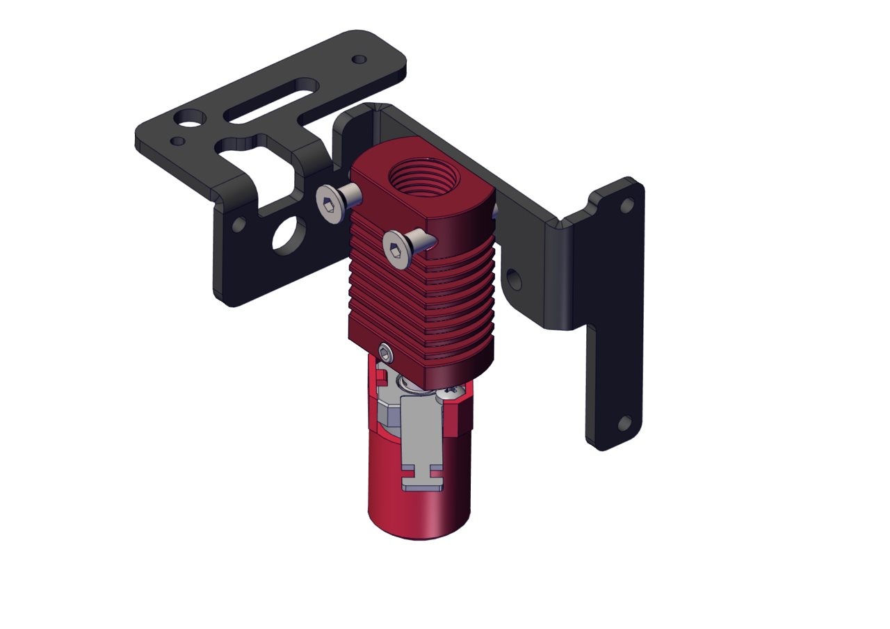
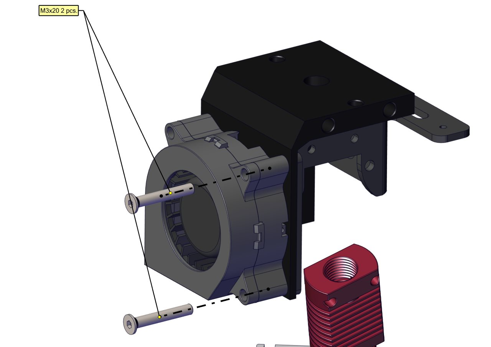
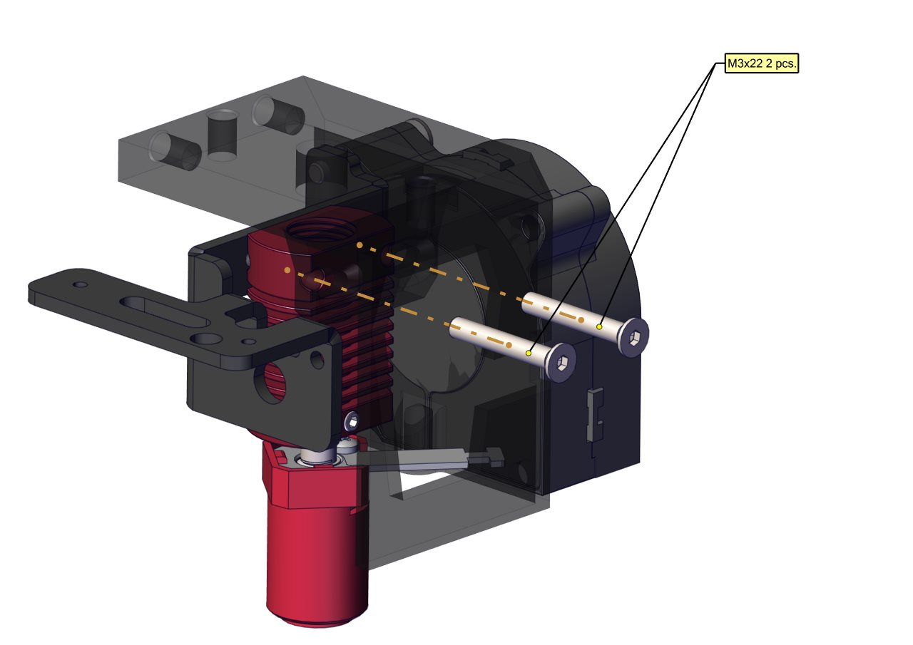
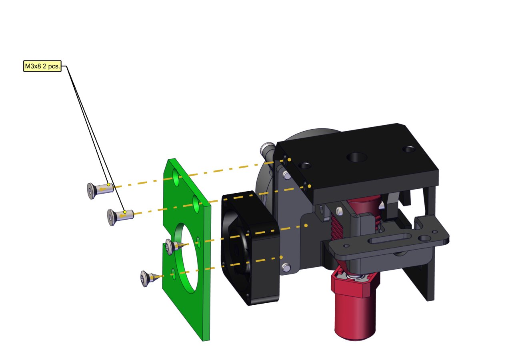
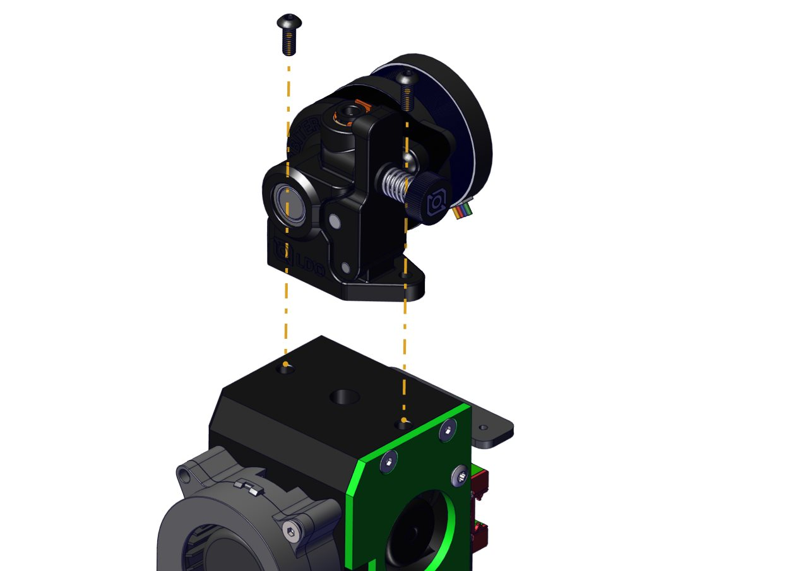
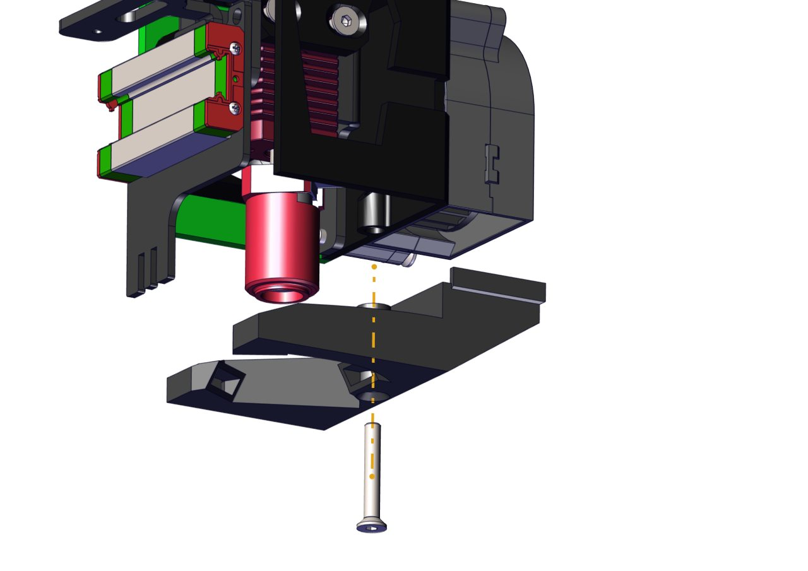

# Assembly instructions
## Wiring
The wiring is the weak part here and I don't provide instructions on it. Please figure it out yourself, there are not many wires in there
## Step 0
Disassemble existing toolheads. That should be easy, just unscrew and unplug everything. You don't need to disassemble heatsink of second toolhead, just unscrew it.
## Step 1

Assemble hotend. Temporarily secure it in place and do cable managment. For CHC you need to cut wires to length and crimp them with proper connectors. You also need to bend metal piece or unscrew it. Make sure wires fit inside chasing.

## Step 2

Remove hotend and secure blower fan and chasing to tool bracket. Using spacers is recommended

## Step 3

Move hotend to place and secure it with M3x22 screws. For right toolhead you may want to use M3x24 screw and nuts are nessecary sicne holes aren't threaded.

## Step 4

Assemble heatsink fan panel using same screws and secure it using two M3x8 screws. Side cut is for routing blower fan wires.

## Step 5

Cut PTFE tube and insert it in heatsink. You need a few mm to peek out to fit it in Orbiter.
Assemble Orbiter using appropriate manual and secure it using screws from it's kit.

## Step 6

Secure fan ducts using M3x20 screw.

## Step 7
Now you can secure toolhead to printer following same steps as in printer's manual. You need to adjust bed endstop, unscrew it and cut plastic tube to length, so it stops at nozzle height or higher.